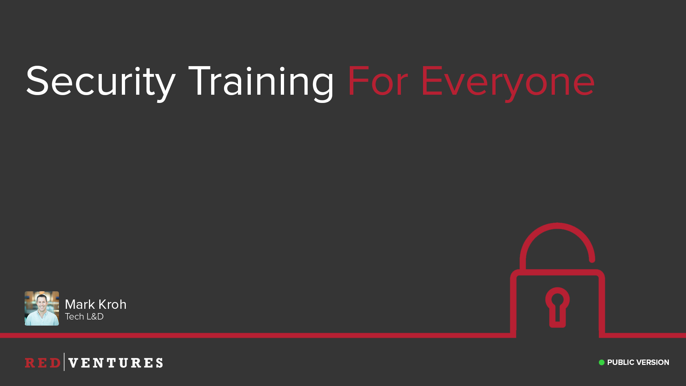
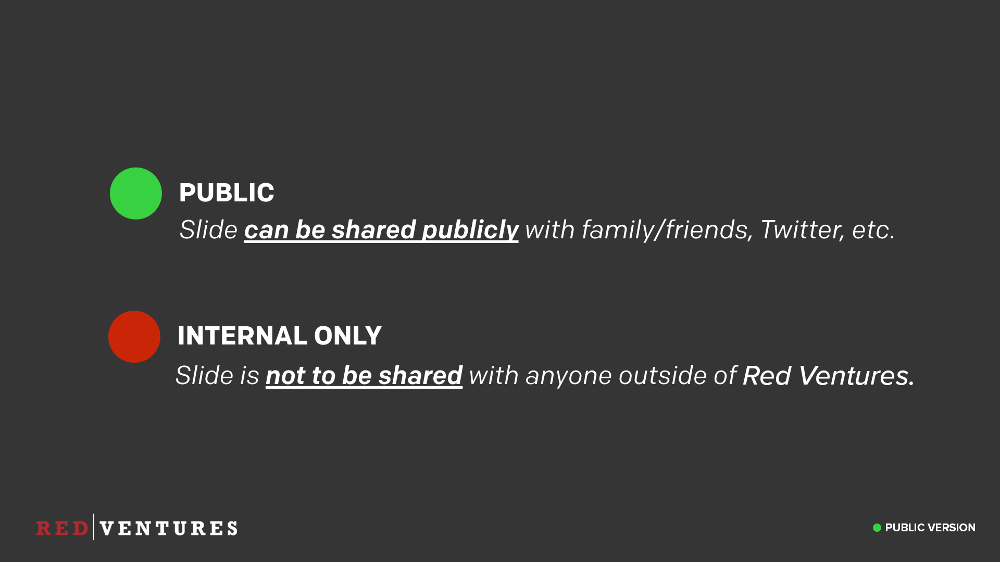
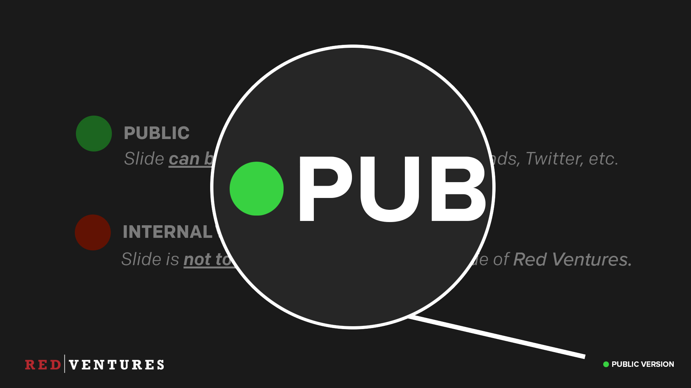
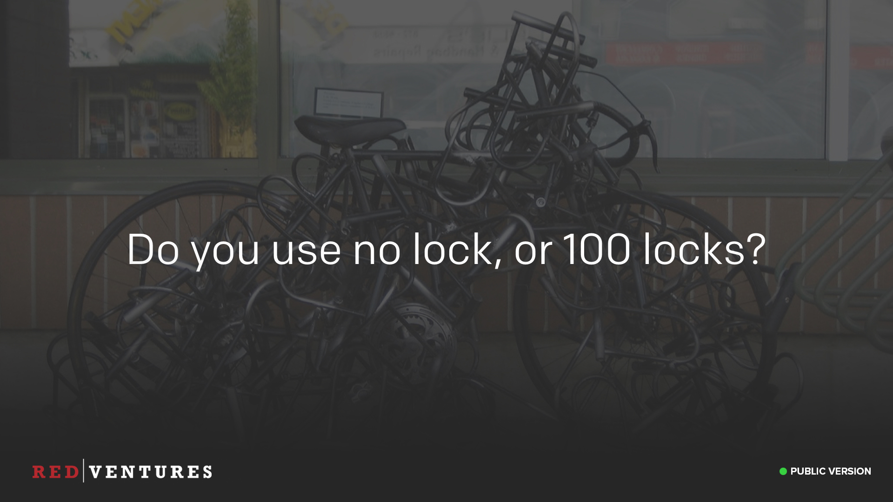
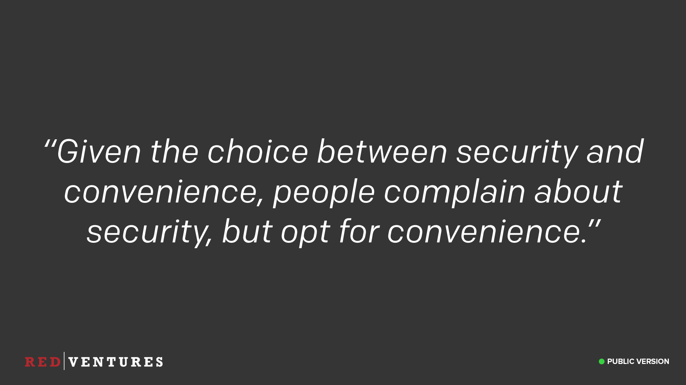
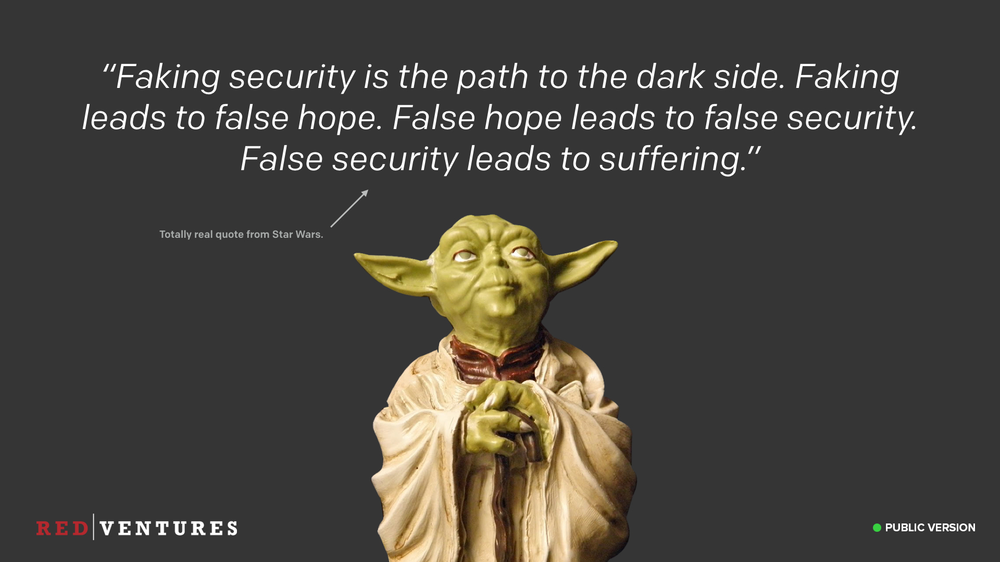
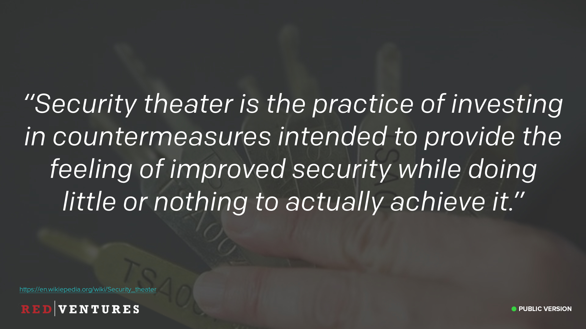
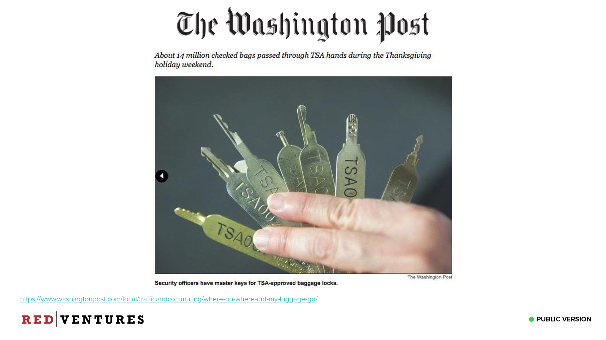

The main topics covered in this training are,

1. [Social Engineering](social-engineering/) - Primarily phishing and how to detect and report such attacks.
2. [Passwords](passwords/) - A crash course in how passwords are cracked, and why it’s important to have strong passwords.
3. [Physical Security](physical-security/) - Guidelines for maintaining the security of our offices and equipment.
4. [Wireless Security](wireless-security/) - How to stay safe when connecting to wireless networks.
5. [Data Handling](data-handling/) - The different types of data we have and how to properly handle that data.
6. [Compliance](compliance/) - How compliance affects our day-to-day operations.
7. [Conclusion](conclusion/)

---

### Introduction

_001. "Security Training for Everyone, March 2018"_

It turns out that if you work with partners in the banking and health care industries that security is a thing. There are even rumors that security is vital to our existence as a company. No, really, I've heard that. And when you do security right that means security certifications and security certifications mean training and, well, that's where your day got changed.

My name is Mark Kroh and I lead our technical L&D programs. Welcome to the Red Ventures annual security awareness training! Over the next hour or so, we'll go over the most important things you'll need to know to help keep yourself, our data, and our future safe. We'll try to do this as painlessly as possible, so let's get started.

---

### Goal

<input type="checkbox" id="002" /><label for="002"></label>
_002. Goal of the training._

Ok, we all understand that security certifications are important to the business. But our philosophy is that what is MORE important is doing things the right way because that is who we are at our core. We want to keep people's data safe. We want to have confidence that when our partners place their trust in us, we will deliver.

The goal of today's training is to make sure that we can maintain and build partner trust by having a staff who is well training against the most common security threats that we face. It's not just about knowing what threats we're up against, it's about knowing how to protect us from those threats too.

Despite our best efforts, the security team can't have eyes everywhere. We rely on all of you to help us to spot security issues and let us know about them.

---

### Testimonial

<input type="checkbox" id="003" /><label for="003"></label>
_003. Testimonial for the training._

If this is your first year at Red Ventures, then this training will be new to you. Actually, even if you've been here since the founding in 2000 this training will be new to you. However, moving forward, we'll be swinging around to this annually. Not the most thrilling prospect for many of you but we've really tried to make this as entertaining and enjoyable as possible, and it's my hope that you don't feel this is a waste of your time. The material I'm going to present should be useful no matter what skill level you already have. Whether you're just joining us as an intern, or are a seasoned security expert.

---

### Classification

<input type="checkbox" id="004" /><label for="004"></label>
_004. Classification ratings for these slides._

Because this information is so valuable, we're going to produce a public version of the slides that you can share with family and friends. Each slide contains a classification level based on the information present in the slide. I'll be producing three versions of the training at the end, one of which will be a public version you can share however you like.

Any slide with a green icon and the word "public" can be shared however you like. If it's orange and says "restricted", then it can only be shared with customers who have signed an NDA. Finally, if it's red and says "internal only", it's not to be shared with anyone outside of Red Ventures under any circumstances.

I've included real examples of ongoing attacks in some of the material, and we want to be sure we don't tip our hand to attackers that we're on to them.

---

### Classification Demo

<input type="checkbox" id="005" /><label for="005"></label>
_005. Showing where slide classifications are located._

If you're unsure where to look, it's down here in the bottom left. For example, this slide is "public".

---

### The Security Team

<input type="checkbox" id="006" /><label for="006"></label>
_006. Security Team._

Andre Mintz, Chief Information Security Officer

Raghu Kotha, Director of Engineering

Carla Sweeney, Director

Jim Sabinske, Director

---

### Our Job

<input type="checkbox" id="007" /><label for="007"></label>
_007. Our job as a security team._

Why does the security team even exist? Despite what you may think, we’re not here to say “No” to everything, or to chastise you for doing something "wrong". We’re here to keep Red Ventures secure, and to make it easy for you to do the right (i.e. secure) thing automatically. Never be afraid to come to us for help, or to let us know you may have done something that put us at risk. We’d rather know about it than not! If we've implemented a security feature that has made your life unnecessarily more annoying, we want to know about that too, since our goal isn't to add features that make your lives harder.

We're not here to be a bottleneck either. You'll notice that user access reviews don't go through the security team, and we don't have to sign-off on everything security related. Teams are trusted to make their own decisions (within reason).

---

### Tracking Attendance

<input type="checkbox" id="008" /><label for="008"></label>
_008. Blue._

One of the new things this year, due to our size, is that we need to track attendance for this training. Typically this is done by either getting everyone to scan their access cards, or by taking roll call. Sometimes it's about sending a survey asking questions about the material and if you answer incorrectly you have to resit the training. We're not going to do any of that, because.. well, because I didn't like any of those options.

Instead, I'm going to satisfy the constraint of tracking attendance in the silliest way possible. At the end of this training, you will get a survey with only two questions. "What was the color?" and "What was the animal?". Yes, there will be a slide at the end with an animal on it.

By answering both questions correctly, this will "prove" you attended the entire training.

Of course, yes, I know this can be gamed. Yes, I know you can cheat. This seemed more fun than any of the other options, and at least makes a good faith attempt at providing evidence you stayed for the entire training. Honor system here folks, I'm trusting you all to help me out here and make this easy.

---

### Question

<input type="checkbox" id="009" /><label for="009"></label>
_008. Bike locks._

Now a quick question to get things rolling. Let's say you're the healthy type, and you like to cycle around the city. You are somewhere around the streets of Charlotte, and need to secure your bike. You have two choices, you can just leave it on the street without any lock at all, or you can take the morning off work and use 100 locks instead. Which do you choose?

Hopefully, you've realized that both of these answers are absurd and aren't going to work. Using no lock leaves you with no security at all and your bike won't be there when you return, whereas using 100 locks will leave your bike very secure, but you'll need to take the day off in order to lock and unlock it.

---

### Security vs Convenience

<input type="checkbox" id="010" /><label for="010"></label>
_008. Security vs convenience._

The point I'm trying to make is that there's a trade-off between security and convenience, with two extreme ends of a spectrum. Too far one way, and we're not secure, too far the other, and we're secure but completely unusable. If you get a bunch of people in a room and ask them if they want to be secure, they'll say yes. But given the choice between being secure and having convenience, most folks opt for convenience.

---

### Be Secure, But Usable

<input type="checkbox" id="011" /><label for="011"></label>
_011. Be secure, but usable._

Our job is to strike a good balance between the options. We want to make sure that Red Ventures as a product/service/partner, and as an office environment, is both secure and usable. Our goal is not to add friction to your day-to-day jobs, but we can't sit entirely at the convenience end of the scale either. So while we may force you into following certain procedures, please know that it's not because we like annoying you, but it's because we don't really have a choice.

---

### No Faking

<input type="checkbox" id="012" /><label for="012"></label>
_012. No faking._

Importantly, we never want to fake security. Putting a sign saying you have a burglar alarm on your front lawn when really you don't might deter a few criminals, but anyone who really wants to steal something will just ignore it anyway.

---

### Faking is the Path to the Dark Side

<input type="checkbox" id="013" /><label for="013"></label>
_013. Yoda, dropping some knowledge on fake security._

Faking security leads us down a dark path, and will give us a false sense of security. There are multiple ways to fake security. Some terms you may have heard of are "Security Through Obscurity", where the secrecy of the implementation is being relied upon. Imagine a padlock manufacturer coming out with a padlock they say is unbreakable. You want to look inside to see how it works, but they say "No no no, you can't do that, that would give away the secret. You're not allowed to look inside!". Criminals, of course, being well known for following the rules.

Another term you may have heard of is "Security Theatre"...

---

### Security Theater

<input type="checkbox" id="014" /><label for="014"></label>
_014. What is security theater? [Reference](https://en.wikipedia.org/wiki/Security_theater)_

This is where you spend time and effort on things which merely give the _appearance_ of improved security, without actually providing it. A lot of people hold up the TSA as an example of this, but I want to use the TSA as another example of where bad security came to bite them.

A "backdoor" is another type of fake security. This refers to when there's a supposedly secret method of bypassing the security of something, typically only given to a few people.

---

### TSA Baggage Locks

<input type="checkbox" id="015" /><label for="015"></label>
_015. Story in the Washington Post. [Reference](https://www.washingtonpost.com/local/trafficandcommuting/where-oh-where-did-my-luggage-go/)_

You may remember a news story a few years ago in the Washington Post. It was around Thanksgiving, and they had an article all about how the TSA keep your bags safe during the holiday period. They held up TSA locks as an example. You've probably seen these locks, where you have a code or key to unlock it, but the TSA have some master keys to also unlock it. The article included a photos of these master keys. Quite a high resolution photo in fact. So I'm sure you can guess what happened next.

---

### 3D Print TSA Master Keys

<input type="checkbox" id="016" /><label for="016"></label>
_016. Print your own TSA master key from the comfort of your own home. [Reference](https://github.com/Xyl2k/TSA-Travel-Sentry-master-keys/)_

Yep, you can now 3D print your own TSA master keys in the comfort of your own home.

Any security provided by these locks are now ineffective. You might still deter a few folks, but anyone who's determined to get in your bags will now have a much easier time of doing it.

Backdoors pop up all over the place. Do any of you have a modem provided by your ISP? Pretty much every one of them has a backdoor on them for the purposes of customer support. A secret password that the customer support agents know, usually derived from your modem serial number in some way, that gives them the ability to change settings if you call them up. A lot of times attackers can figure out the patterns used and also get access to your modems. Google ["ARRIS modem backdoor"](https://encrypted.google.com/search?q=ARRIS+modem+backdoor) if you want to read about one example.

Hopefully you're starting to see why faking security is a bad thing, and something we want to stay away from.

---

