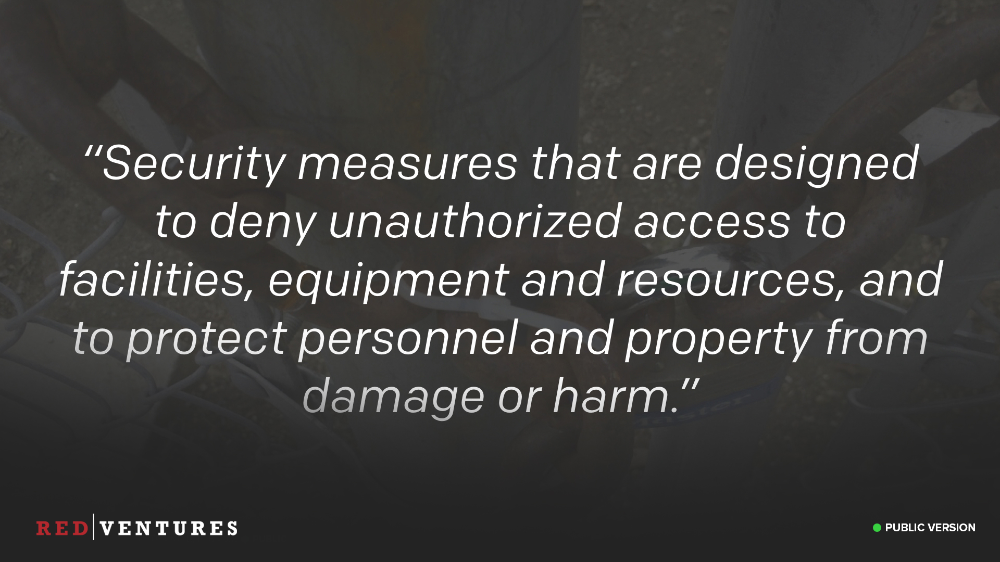
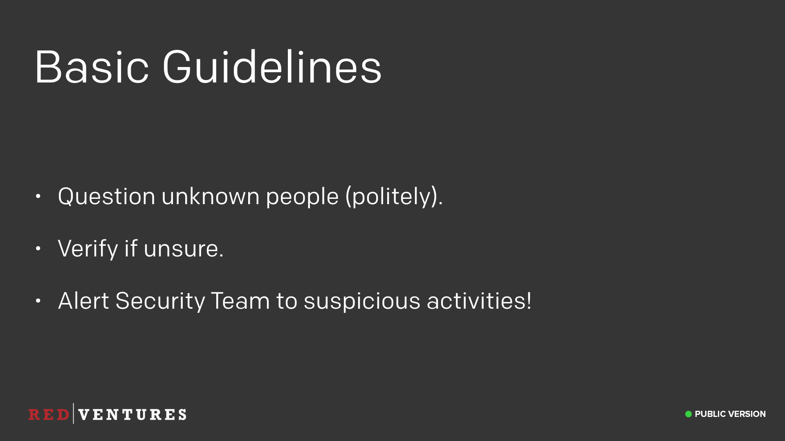

### Physical Security

_<input type="checkbox" id="107" /><label for="107"></label>
_101. Physical Security._

These next two sections will go much quicker, I promise. We're now going to talk about physical security. I don't mean bouncers.

---

### What is physical security?

<input type="checkbox" id="108" /><label for="108"></label>
_102. What is physical security?_

I mean security that's designed to protect our offices, personnel, and equipment.

---

### Basic Guidelines

<input type="checkbox" id="109" /><label for="109"></label>
_103. Basic Guidelines._

We're growing really quickly now, and it's very easy to lose track of who works here and who doesn't at any given time. Gone are the days where we could all fit into a single meeting room.

It's important to keep our office environment secure though, we don't want random folks wandering around stealing information or equipment. If you see someone you don't recognize acting suspicious, just ask questions. Introduce yourself and make a new friend, since 99% of the time it's going to be an employee you've simply not met yet.

If their answers don't satisfy you, and you think they're sketchy, alert the security team and we'll take care of it. Don't put yourself in danger, and leave if you feel uncomfortable.

---

### Ask Questions

<input type="checkbox" id="110" /><label for="110"></label>
_104. Ask Questions._

If you see something, say something! But be polite, don't shove someone up against the wall shouting "Who do you work for!!?!?!", this isn't a movie. If someone is wandering around looking lost, ask them where they're heading. It's likely just a new employee. And if you are uncomfortable speaking to them directly, at the very least let the security guards know what's going on.

For example, if someone you don't recognize is sitting at your friend's desk using their laptop, that's something you probably want to let the security team know about pretty quickly. Speaking of which...

---

### Lock Your Computers!

<input type="checkbox" id="111" /><label for="111"></label>
_105. Lock Your Computers!._

Please lock your computers when you're not with them. It literally only takes a few seconds for someone to access your machine and do some really nasty things using your login credentials.

If you wander around the office and see someone else's computer unlocked, please lock it for them, then send them a private message on Slack letting them know it was unlocked and that you locked it. Resist the urge to troll the user by changing their background or typing as them on Slack. That's not the kind of environment we're trying to foster.

Also we used to do that, and it just makes people feel bad and doesn't give you the results you want.

---

### Piggybacking

<input type="checkbox" id="112" /><label for="112"></label>
_106. Piggybacking._

Beware of "Piggybacking", this is where someone else follows you through a secure door on your keycard swipe. A common social engineering trick is to just act like you belong and follow people through a door they've opened for you. Usually carrying something heavy with both hands to explain why they can't swipe their own keycard.

Always verify other people coming in on your keycard. If they're co-workers you recognize, then of course let them in. But if you don't recognize them, ask them to tap their own keycard too. Then introduce yourself, and make a new friend, since it's a coworker you'd not met yet.

Likewise, if you're following someone through a door and they ask you to tap your keycard, please don't give them any grief. Tap your keycard, and then introduce yourself and make a friend.

---

### Building Security

<input type="checkbox" id="114" /><label for="114"></label>
_107. Building Security._

Once you've used your keycard to unlock a door, please don't prop it open. The doors are locked for a reason, and propping them open kind of defeats that. Listen for the sound of the door closing behind you.

Make sure all your visitors sign in at the front desk, and have a name badge. Not only is this good (required) security practice, but it's required for fire safety too, so we know how many people are in the building should we need to evacuate.

---

### Laptop Stolen?!

<input type="checkbox" id="115" /><label for="115"></label>
_108. Laptop stolen?!._

So you're at a bar after work, you look down on the floor and see that your backpack has been stolen, and your Red Ventures issued laptop was in there. It was likely stolen by someone wearing a balaclava, since we know that's what all criminals wear based on my stock image searches.

What do you do?

Well, first, let's back up and talk about some common sense guidelines for protecting your laptop off-site. It should never be left unattended in plain view in your car. Lock it in the trunk if you need to leave it in there. And maybe avoid taking it into a bar or other public place where you may be distracted. And when you travel, please don't pack it in your checked luggage. That's a bad idea for a number of reasons!

But let's say the worst happens even though you've taken these precautions. What do you do?

---

### Panic?

<input type="checkbox" id="116" /><label for="116"></label>
_109. Panic?._

Your first instinct is to probably panic. That's OK, it's a natural reaction.

---

### Don't Panic

<input type="checkbox" id="117" /><label for="117"></label>
_110. Don't Panic._

But don't panic. Things get stolen, it's just the world we live in. You're not going to get fired, you're not going to get into trouble.

_(Unless you stole the laptop yourself, in which case, yeah.. you'll probably get into trouble)._

---

### Page Security

<input type="checkbox" id="118" /><label for="118"></label>
_111. Page us!._

Notify the help desk (help@redventures.com) at any time if you have lost or had stolen, any devices that access Red Ventures information. The help desk logs these incidents and has procedures to initiate the removal of the device from the network. Whether it's your Red Ventures issued laptop, or your personal phone which was logged into your GitHub account. Let us know immediately so we can lock it out from all our systems and get you a new device issued.

---