### Social Engineering

_<input type="checkbox" id="017" /><label for="017"></label>_

Social Engineering is our first topic of the day, and that stock image is quite possibly my favorite ever. Seriously, why wear a balaclava while on the phone? It makes no sense!

---

### What is Social Engineering?

<input type="checkbox" id="018" /><label for="018">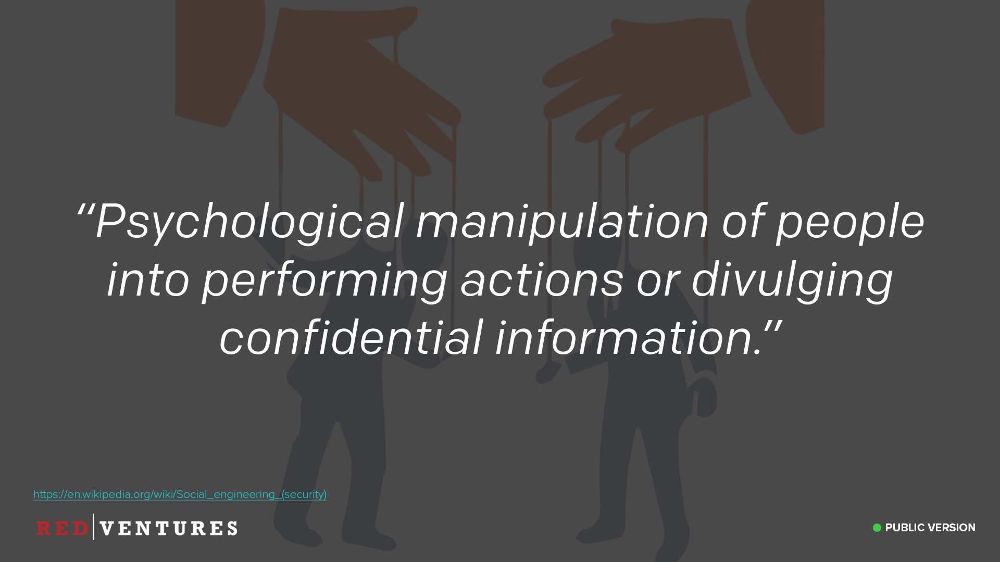</label>
_018. What is social engineering? [Reference](https://en.wikipedia.org/wiki/Social_engineering_(security))_

For those who've not heard the term before, here's a quick definition of what social engineering is. Basically it's a type of confidence trickery. Convincing people to give up information either without them realizing it, or by making them believe you're someone else.

---

### Catch Me If You Can

<input type="checkbox" id="019" /><label for="019"></label>
_019. Catch Me If You Can. [Reference](https://www.youtube.com/watch?v=iJIc16aqpO8)_

If you've ever seen the movie ["Catch Me If You Can"](https://www.imdb.com/title/tt0264464/) (or read the book) you will have seen lots of examples of social engineering. "[Ferris Bueller's Day Off](https://www.imdb.com/title/tt0091042/)" is another one. If you've not seen either of those movies, I'd highly recommend giving them a watch. The link at the bottom of the slide here is to a [talk by Frank Abagnale Jr](https://www.youtube.com/watch?v=iJIc16aqpO8), the real person on which Catch Me if You Can is based. He tells the story of his exploits. It's quite entertaining and eye opening.

---

### Building Trust

<input type="checkbox" id="020" /><label for="020">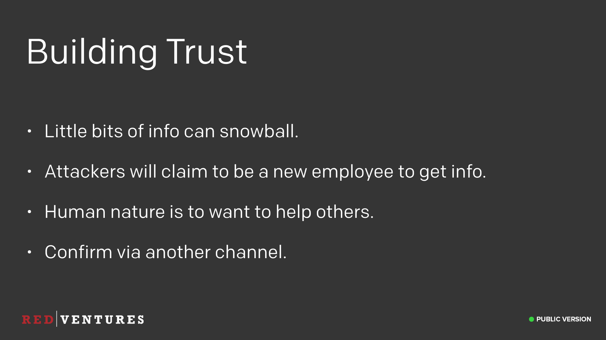</label>
_020. Building Trust._

Social engineering is mostly about building trust. If I wanted to social engineer the CEO of Red Ventures, Ric would not be my first phone call. I'd start by calling a low-level employee claiming to be a new employee needing help, or I'd call a new employee and claim to be an established employee asking for help. I'd learn some little bits of information, maybe a bit of internal lingo that's being used. Then the next person I call would be slightly higher up the chain, I'd use the information I learned on the first call to sound more credible. And so on and so on.

By the time I call the CEO, I'd have so much internal knowledge and language for the company that it would sound like I was an employee anyway.

This is hard to defend against, since human nature is to want to help others. So if someone contacts you claiming to be an employee, and you've never heard of them before, verify they are who they say they are via another channel. If they email you, ping them on Slack to check (and vice versa).

---

### Employee Directory

<input type="checkbox" id="021" /><label for="021"></label>
_021. Redacted slide._

Another way to verify if someone works here is to check the [Employee Search](https://intranet.redventures.net/admin/hr/employee_search.php) on the Red Ventures' intranet. A bonus of doing this is seeing some of the truly horrific first-day mug shots we take!

---

### ~~Fishing~~ Phishing

_<input type="checkbox" id="022" /><label for="022">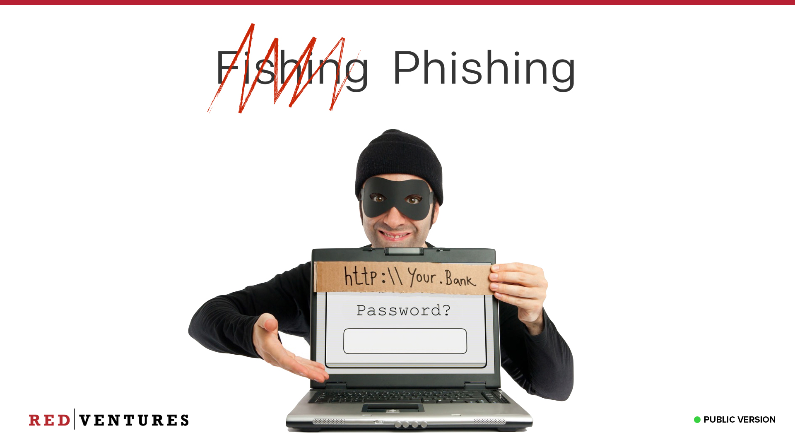</label>_
_022. ~~Fishing~~ Phishing._

I'm going to focus on one particular type of social engineering attack that we get exposed to, phishing (with a P-H), and again, this is another one of my favorite stock images. The term comes from "fishing for information", and generally involves receiving an email designed to trick you into giving up information. As we get larger as a company, we become more of a target for these types of attacks.

---

### Nigerian Prince Scam

<input type="checkbox" id="023" /><label for="023">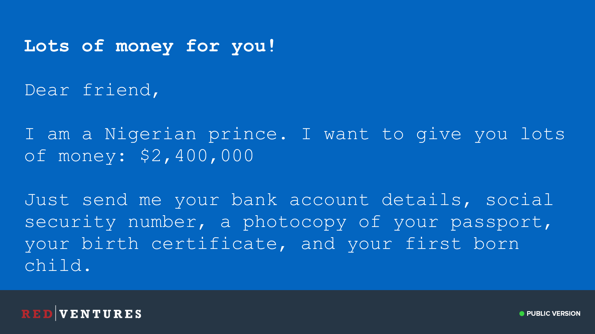</label>
_023. Nigerian Prince Scam._

Some phishing attacks can be pretty easy to spot. You've all likely heard of the Nigerian Prince Scam. This is where an email claiming to be someone who can give you lots of money is sent to lots of people. This is a very "spray and pray" approach to scamming. Maybe 1 or 2 people will bite, but that makes it worthwhile enough for the scammer. These are pretty easy to spot, and not something we really worry about. Hopefully none of you would ever fall for something like this.

---

### Is My Credit Card Stolen?

<input type="checkbox" id="024" /><label for="024">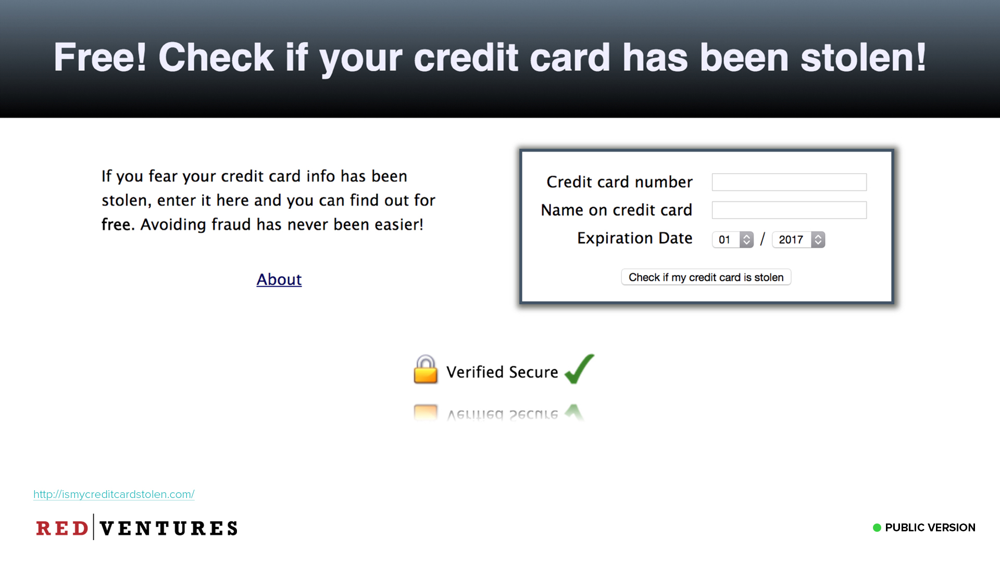</label>
_024. ismycreditcardstolen.com. [Reference](http://ismycreditcardstolen.com/)_

But you don't even have to send emails to people, sometimes you can just lay a trap and people will gladly provide you with information instead. Here's a great website, [ismycreditcardstolen.com](http://ismycreditcardstolen.com). You just enter your credit card information, and it'll helpfully tell you if it's been stolen or not. Of course, as soon as you enter the details, your credit card information has in fact been stolen.

But it has that nice "Verified Secure", with the padlock and green tick, so it must be OK, right?

> I should be clear that this isn't really a bad website, and is safe to visit. It's made to point out to people that they shouldn't fill in their details on random sites.

---

### Need a Debit Card?

<input type="checkbox" id="025" /><label for="025">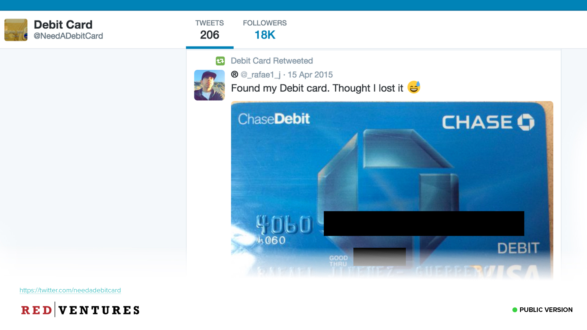</label>
_025. twitter.com/needadebitcard. [Reference](https://twitter.com/needadebitcard)_

Taking it a step further, sometimes you don't even need to lay a trap, you can just search the internet for the information you want. There's a great Twitter account called [@NeedADebitCard](https://twitter.com/needadebitcard), which retweets people who post pictures of their debit cards to Twitter.

It gets better, because often the replies will be _"Looks great, what does the back look like?"_, and then they'll go and post a picture of the back too!

I really hope none of you would fall for anything like this.

These are all interesting to see, but the type of attack we care most about are the more targeted ones.

---

### Reel or Fish?

<input type="checkbox" id="026" /><label for="026"></label>
_026. Reel or Fish?._

So I'd like to play a quick game with you all now. I know, audience participation, right? But don't worry, it's a fun game, honest.

It's a game I've called "Reel or Fish?"

---

### Real or Phish?

<input type="checkbox" id="027" /><label for="027">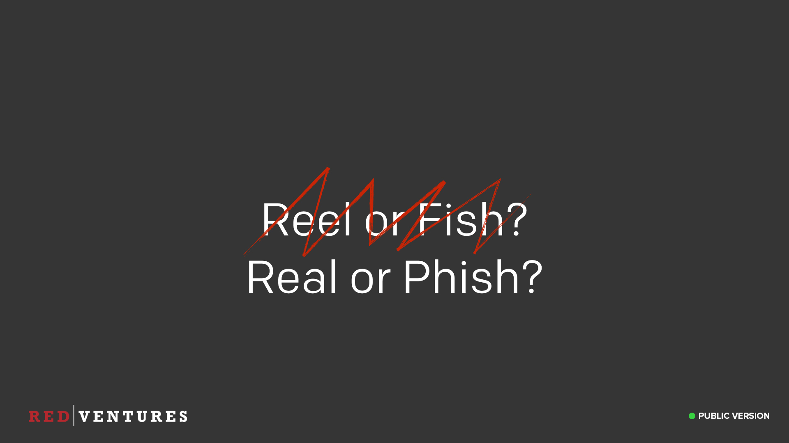</label>
_027. Real or Phish?._

Sorry, I mean "Real or Phish?"

I'm going to show you some genuine emails that have been sent to employees of another company (shared with the recipients permission of course), and it's your job to tell me if you think it's a real email, or a phishing attempt.

---

### Your account has a debt and is past due.

<input type="checkbox" id="028" /><label for="028">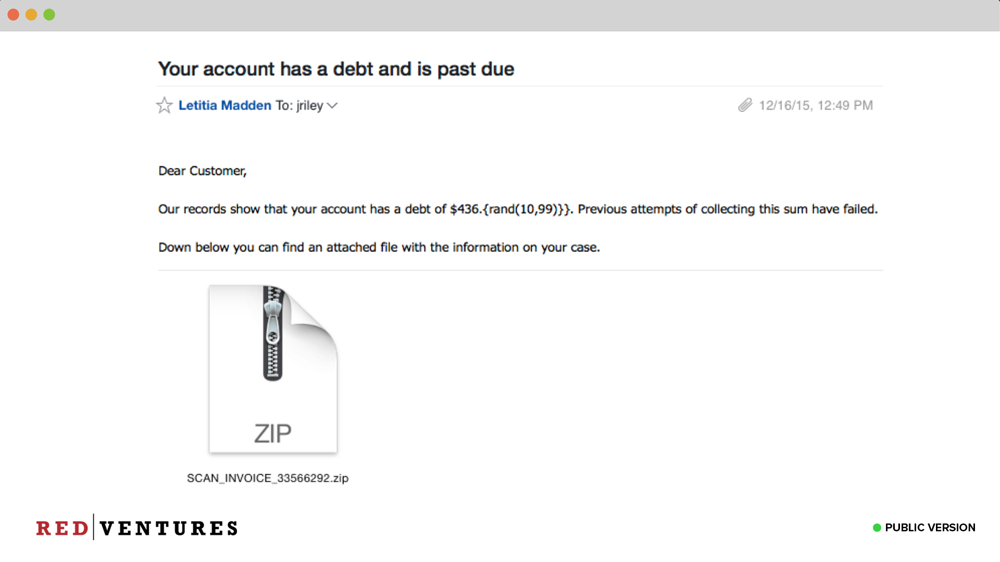</label>
_028. Your account has a debt and is past due._

Let's start with this one.

_"Our records show that your account has a debt of $436.{rand(10,100)}}. Previous attempts of collecting this sum have failed."_

What do we think?

---

### Phish!

<input type="checkbox" id="029" /><label for="029">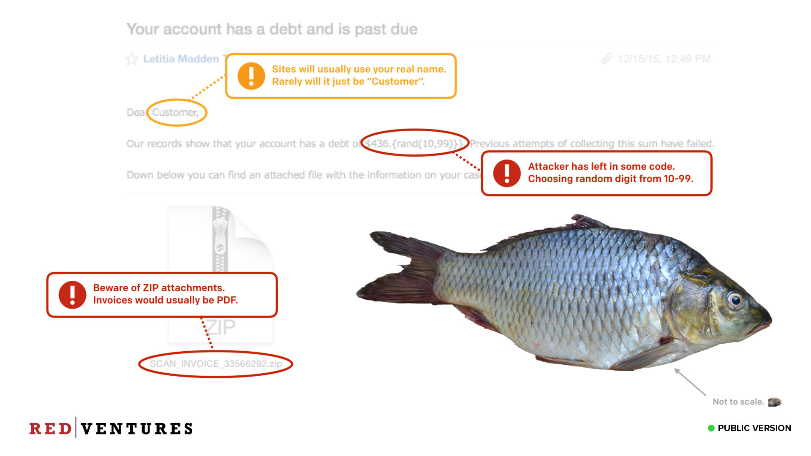</label>
_029. Phish!._

Yes, of course this is a phishing attempt. Quite an easy one to spot thanks to the fact the attacker left in their templating code rather than putting in the cents value. But there were some other indicators here too,

* A yellow flag in that it said "Dear Customer", most emails now will be personalized with your name if they know it.
* A red flag in that there's a `.zip` attachment for an invoice, as these would typically be a PDF.

But of course, the primary red flag is the templating code.

---

### DocuSign?

<input type="checkbox" id="030" /><label for="030"></label>
_030. DocuSign?_

Ok, let's try another one. What do we think about this email from DocuSign?

Looks like a genuine DocuSign email, has the usual style, same big "Review Document" button. Anything suspicious here?

---

### DocuSgn

<input type="checkbox" id="031" /><label for="031">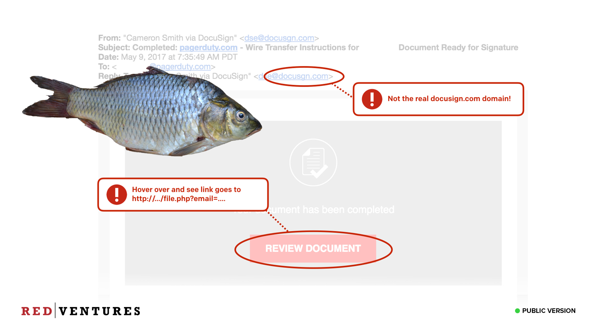</label>
_031. DocuSgn._

This is another phishing email. If you look closely at the domain name in the email, you'll see that it's not the real `docusign.com` domain, but rather `docusgn.com` (Note the missing `i`). An attacker specifically registered a domain similar to the real one, and sent emails that for all intents and purposes look like the real thing, in order to try and steal your DocuSign credentials. Attacks like these are becoming more and more common.

One thing you wouldn't have been able to tell from my screenshot, but would if you were viewing this in your email client, is that the "Review Document" link doesn't actually go to a DocuSign domain either. It went to some completely different domain (it wasn't even close to docusign.com) and had some parameters at the end which included your email address.

One takeaway here is to be sure to hover over any links to see the real address they go to _before_ you click on them. Just because the text in the email says one thing, it doesn't mean that's where the actual link may go. Never click on any links in email that are even remotely suspicious. Sometimes all it takes is a click to do bad things.

> Top tip: If it’s a shortened URL with bit.ly, you can append a `+` to the URL to see where it goes without actually following it.

If you do accidentally click a link in a phishing email, please let us know immediately, as it can affect how we respond to the incident. Don't lie to us to save face, we're not going to ridicule you or shout at you for clicking it, we want to know so that we can properly respond to any potential exploit that could have happened.

---

### More Phishing Examples

<input type="checkbox" id="030" /><label for="030"></label>
_032-036. Redacted slides._

Redacted
> A series of slides have been redacted here. They gave examples of more sophisticated phishing attacks that have been waged against Red Ventures employees, and the indicators we used to detect them. We are not including them in the public version to avoid tipping our hand that we detected them.

---

### Spear Phishing

<input type="checkbox" id="037" /><label for="037">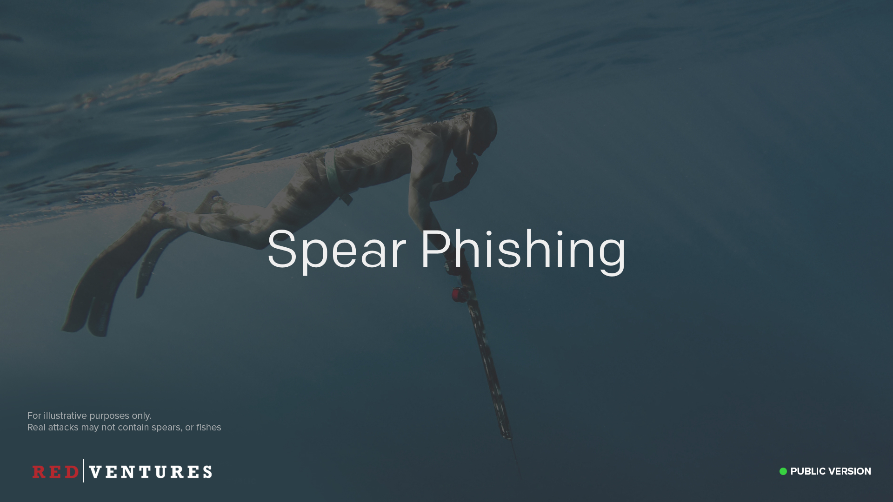</label>
_037. Spear phishing._

These much more targeted attacks are called "[Spear Phishing](https://en.wikipedia.org/wiki/Phishing#Spear_phishing)". An attacker spent a lot of time learning about our internal org structure and crafting a legitimate looking email in order to try and get lots of money from us. These are the types of attacks we care the most about protecting against. Ric recently spoke about an email he got that looked like it was a reply to him from our CFO and the only thing that tipped him off that it was a fake was a subtle difference in the way the "original" email was signed compared with how Ric normally signs. You really have to be on your game with these hacks!

---

### Phishing Archive

<input type="checkbox" id="038" /><label for="038"></label>
_038. Redacted slide._

Redacted
> This redacted slide showed an image of our internal "Phishing Archive" where we document all of the phishing attacks against us that we've detected, what the indicators were, and how we were able to detect them (whether automated, or via employee report). We've chosen not to share this slide, again, to avoid tipping our hand on some types of attacks.

---

### Protecting Yourself

<input type="checkbox" id="039" /><label for="039">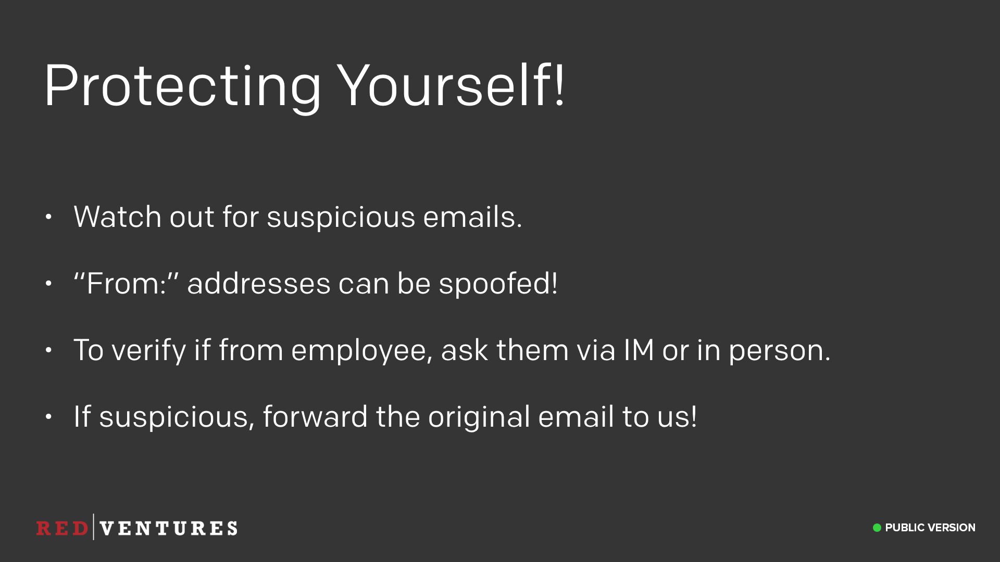</label>
_039. Protecting yourself._

So how do we protect ourselves from this type of attack? Unfortunately there's no golden rule I can give you. It's up to us all to remain vigilant and watch for the signs of suspicious emails. Some things to take care with, the "from" address of email can easily be spoofed. There are technologies that can help to prevent this, but they're not implemented everywhere. So while a misspelled domain is a strong indicator of phishing, a real domain isn't a 100% indicator that it's genuine.

It's like postal mail, you can put whatever you want as the return address, doesn't mean it really came from there. (In fact, this used to be an old scam, you could swap the return and mail-to address, mail it without postage, and the post office would return to the "sender". I would strongly advise against trying this though, since mail fraud is a Federal offense here in the US).

Don't forget that if you get a communication from someone which sounds suspicious, confirm with them via another channel (Slack, etc). Especially if money is involved!

And if you suspect you've received a phishing attempt, send it on over to the security team so we can improve our filters (and add it to the Phishing Archive).

Finally, remember to **never click on any links in a mail you think may be phishing**. Don't even do this to try to get more info about whether it might be phishing - sometimes that click is all that needs to happen for very bad things to happen.

---

### Reporting Phishing

<input type="checkbox" id="040" /><label for="040">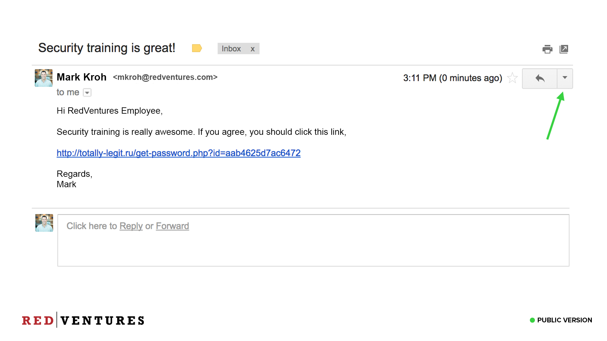</label>
_040. Reporting phishing._

As of January 2018, if you do need to report phishing to us, use the following process. Within the email message, a “Red Alert” link will be displayed. Ironically, this is blue. Once you get past the cognitive dissonance of this, simply click Report Phishing.

---

### Reporting Phishing (2)

<input type="checkbox" id="041" /><label for="041">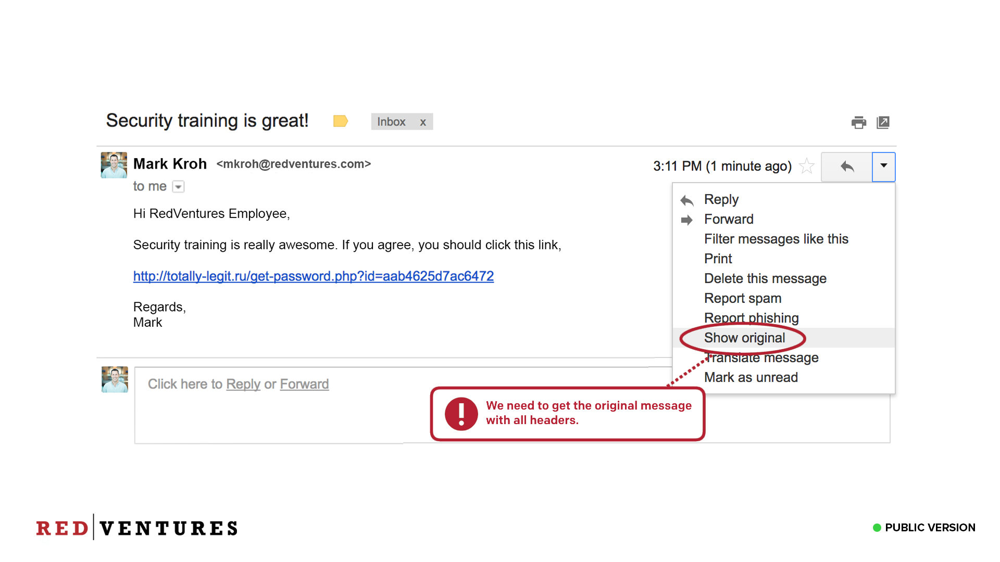</label>
_041. Reporting phishing._

The email will be removed from your inbox and sent to the security team for review. The security team will notify the end user of the outcome within 72 hours, returning non-suspicious messages to the recipient.

If the phishing message is part of a security-driven phishing test, you will receive instant feedback if the message is reported.

---

### Reporting Spam

<input type="checkbox" id="042" /><label for="042">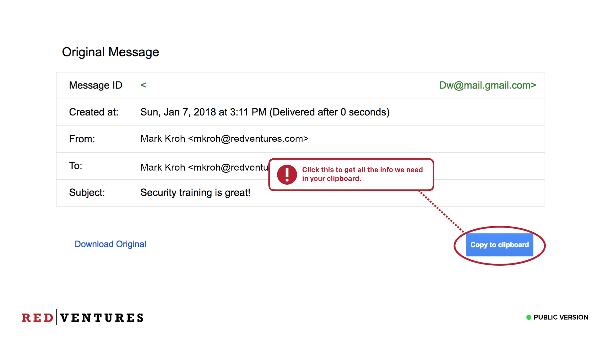</label>
_042. Reporting spam._

While we're on the topic of reporting phishing, just a quick note that you can do the same with spam. Spam is considered unsolicited bulk email or any email that is unwanted or unrequested by the recipient. These are mostly commercial advertising but may include chain letters, political mailings, etc.

You can report Spam in the MimeCast tab of Outlook if you are on a PC. The Spam you report could be the Spam blocked for the rest of Red Ventures. In addition, you can block senders from reaching your inbox in the future

---

### You Are Our Greatest Asset!

<input type="checkbox" id="044" /><label for="044">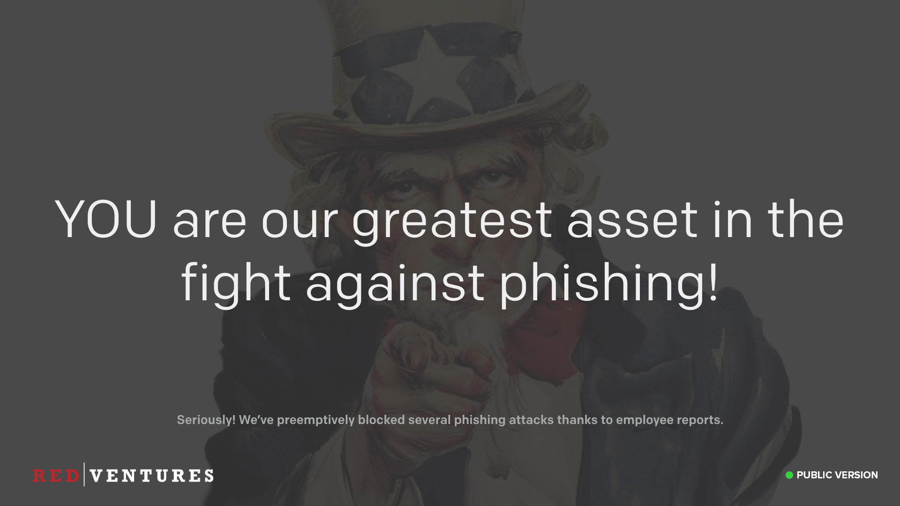</label>
_044. You are our greatest asset!_

We don't read your emails, and automatic filtering only gets us so far. It's up to all of you to be able to spot suspicious emails and send them to us. The good news is that you're already great at this! We managed to preemptively block several phishing attacks last year thanks to quick employee reports. Most were deleted from your inbox before you even read them. Don’t assume someone else has already sent us the example, do it anyway. We’d rather have 300 duplicate reports than no report at all.

---

### Not Just Phishing

<input type="checkbox" id="045" /><label for="045">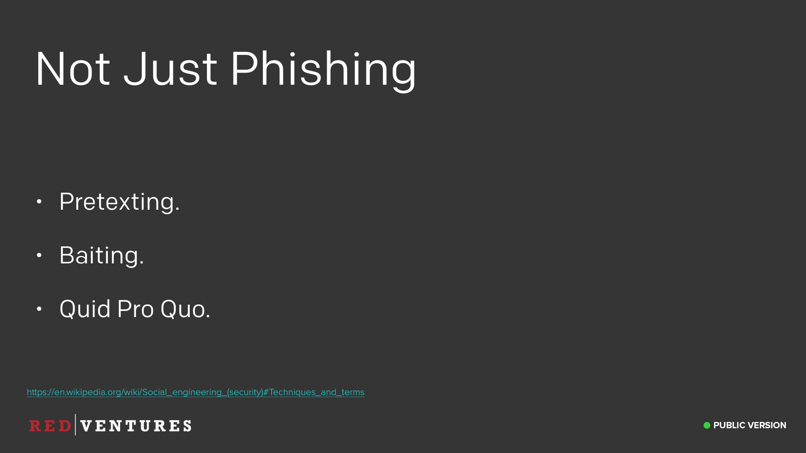</label>
_045. Not just phishing. [Reference](https://en.wikipedia.org/wiki/Social_engineering_(security)#Techniques_and_terms)_

Social engineering isn't just about phishing, even though that's what I focused on here. There are many more types of social engineering attacks we can face.

For example, the meeting invite for this training said that there would be free cake and desserts served. Sorry to disappoint, but that was a lie, and is an example of "Baiting".

Another type of social engineering is called "Pretexting", pretending to be someone else to get information. For example, let's say you're on the Frontier team and you receive a phone call: "Hi, this is Tim from Frontier, we're having trouble with the website. I need to speak to our tech account manager right now, this is urgent, we're losing $100,000's every minute here!", you'd probably say "Sure, let me put you in touch with her!", and now you just gave away that Frontier is a customer, to someone who hadn't verified who they are. Very easy to get tricked this way, but very hard to defend against without being confrontational.

One thing to beware of is a forced sense of urgency. In the above example, the attacker threw about the fact they were losing $100,000's every minute, in order to try and add urgency to the situation and force you to make rash decisions. I don't have a perfect way to solve this, just be vigilant, and report anything suspicious.

Another trick social engineers like to pull is to force you into a particular communications channel. For example, if you receive an email claiming to be from an employee, but they say they're out of office and can't be contacted by phone today and would rather you communicate via email. This is why it's important to verify via another channel if you're unsure.

One final example of social engineering would be leaving a USB drive lying on the floor with a virus on it. People love to pick up free USB drives for some reason. Scatter them outside of the office and see if anyone plugs them in, getting you access to a corporate network. If you find a USB drive on the floor and it's not yours, please don't let it anywhere near your computer. Yes, I know we've disabled the USB drives in most laptops, but still. Don't do it.

---

### Ask us!

<input type="checkbox" id="046" /><label for="046"></label>
_046. Ask us._

As with anything security related, if you're not sure if you've encountered a social engineering attack, or if you're curious to know more, just ask us!

---